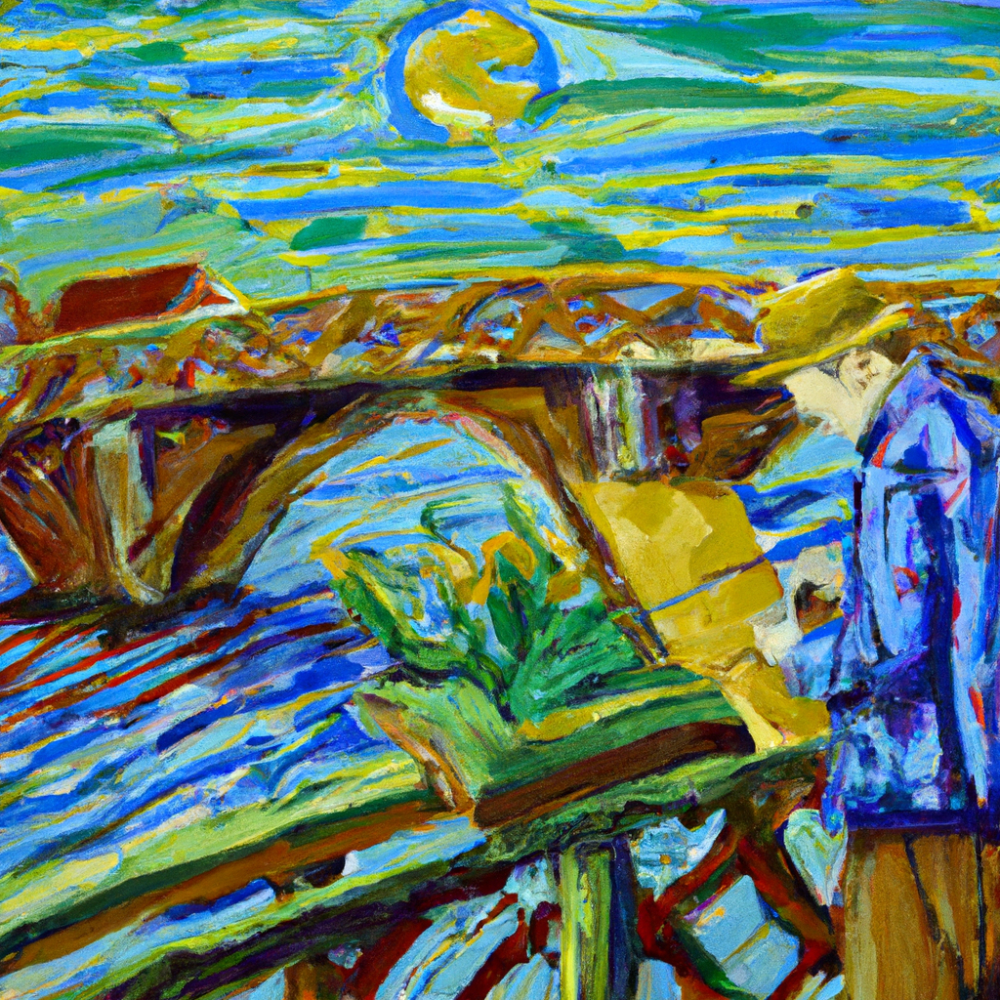
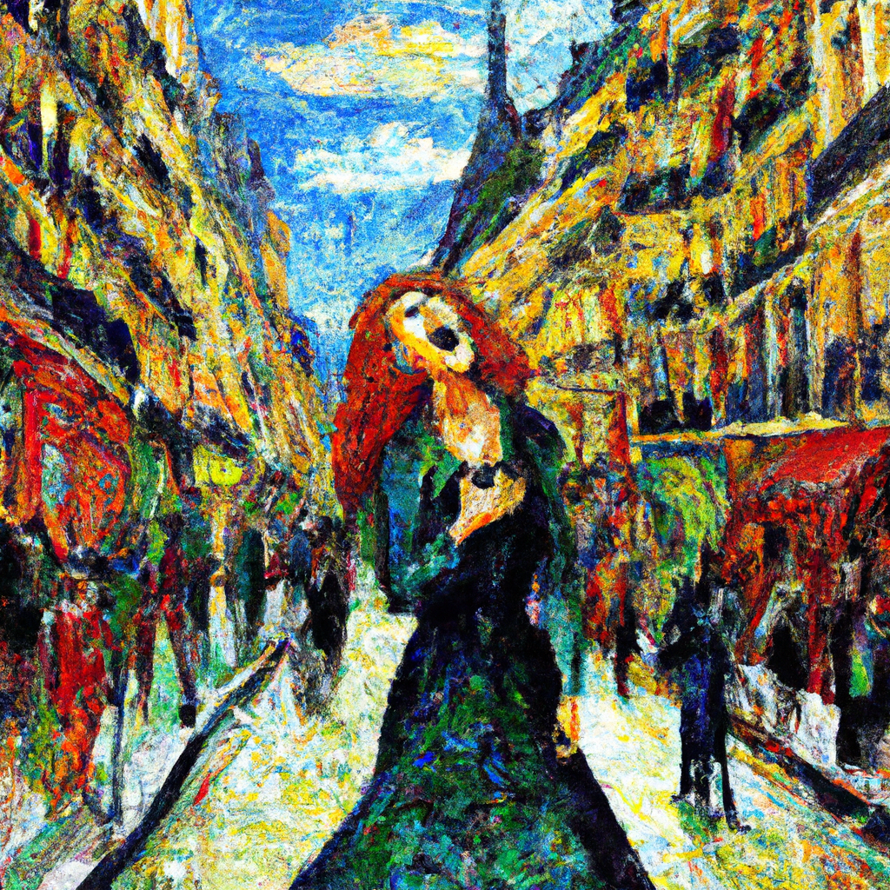
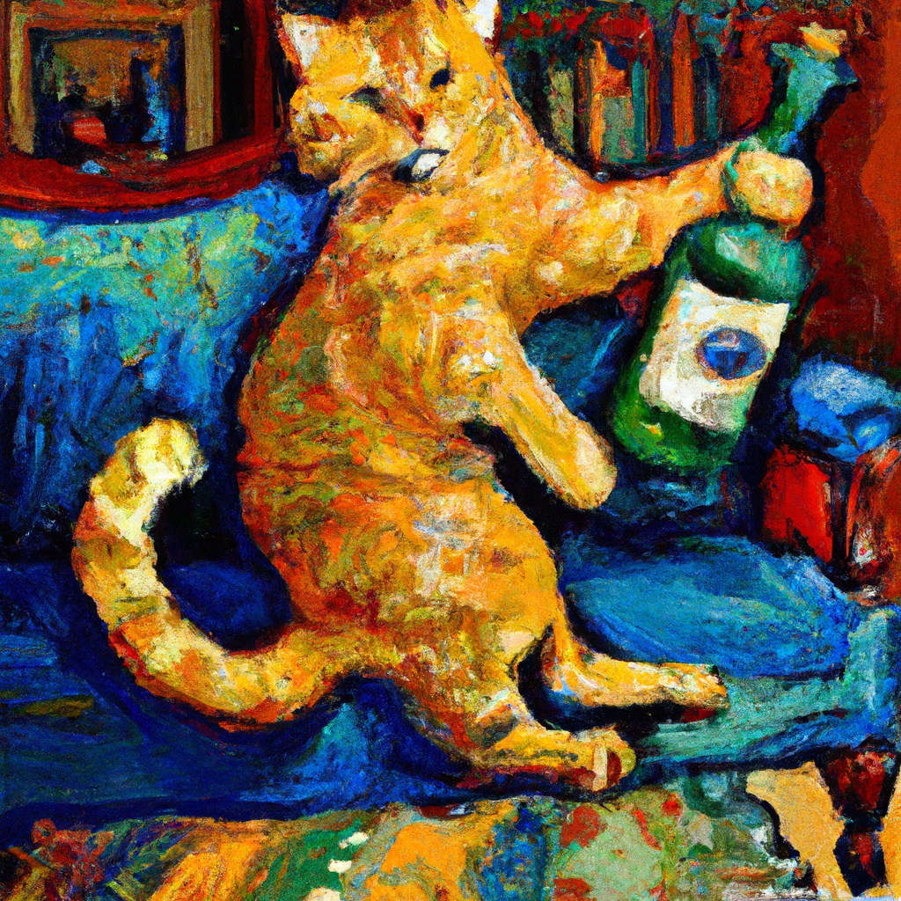

The following page list some of execution results.

**Model:** `gpt-3.5-turbo`

**Assistant Instructions:**
```
Consider user input as starting prompt for image generation. Extend the prompt to generate pictures similar to Vah Goch drawings. Prompt must be length 1000 or less. Example:
User Input: "windy and rainy summer day in a Gogh style into"
Output:  "windy and rainy summer day, painting by Van Gogh, post-impressionism movement, expressive mood, circa 1880, oil on canvas, trending on Christie’s auction. Prompt must be length 1000 or less."
```

### Execution 1 ###

User input
```
I want a drawing
…of a man
…with a paintbrush
… writing a letter
…on a bridge
```

Assistant response
```
A drawing inspired by Van Gogh featuring a man with a paintbrush writing a letter on a bridge. The scene is set on a windy and rainy summer day, capturing the expressive mood often seen in Van Gogh's works. The style reflects the post-impressionism movement, with vibrant brushstrokes and bold colors. This piece, done in oil on canvas, depicts a poignant moment intertwining art and communication. It evokes a sense of contemplation and creativity, inviting viewers to immerse themselves in the beauty of the moment. This artwork would surely be highly sought after, with its timeless appeal and its ability to captivate the hearts of art enthusiasts worldwide.
```

Generated image


### Execution 2 ###

User input
```
I want a drawing
…of a woman
…with a flower
…singing opera
…on a street
```

Assistant response
```
A vibrant depiction of a woman singing opera on the street, inspired by Van Gogh's style, is characterized by his signature expressive brushstrokes and vibrant color palette. The scene captures the woman passionately belting out a beautiful aria, surrounded by a bustling city backdrop. The street is adorned with charming buildings and bustling activity, while the woman holds a single flower in her hand, adding a delicate touch to the composition. The painting exudes a sense of movement, as if the viewer can almost hear the melodious sound of the woman's voice echoing through the streets. This artwork pays homage to Van Gogh's post-impressionist style, showcasing his ability to capture the energy and emotion of a moment in time.
```

Generated image


### Execution 3 ###

User input
```
I want a painting
…of a cat
…with a bottle
… dancing step
…on a sofa
```

Assistant response
```
A whimsical painting of a dancing cat with a bottle, Van Gogh style. This post-impressionist masterpiece showcases Van Gogh's distinctive brushstrokes and vibrant color palette. The cat and its bottle take center stage, with lively movements and a sense of joy emanating from the canvas. The background features a cozy sofa, accentuating the domestic atmosphere. This artwork, painted in the expressive mood of Van Gogh's works, captures the essence of a playful and enchanting scene. An oil on canvas creation from circa 1880, this painting is sure to capture the attention of art enthusiasts and ignite conversations for years to come. Get ready to see this captivating image trending on the world-renowned Christie's auction house.
```

Generated image
